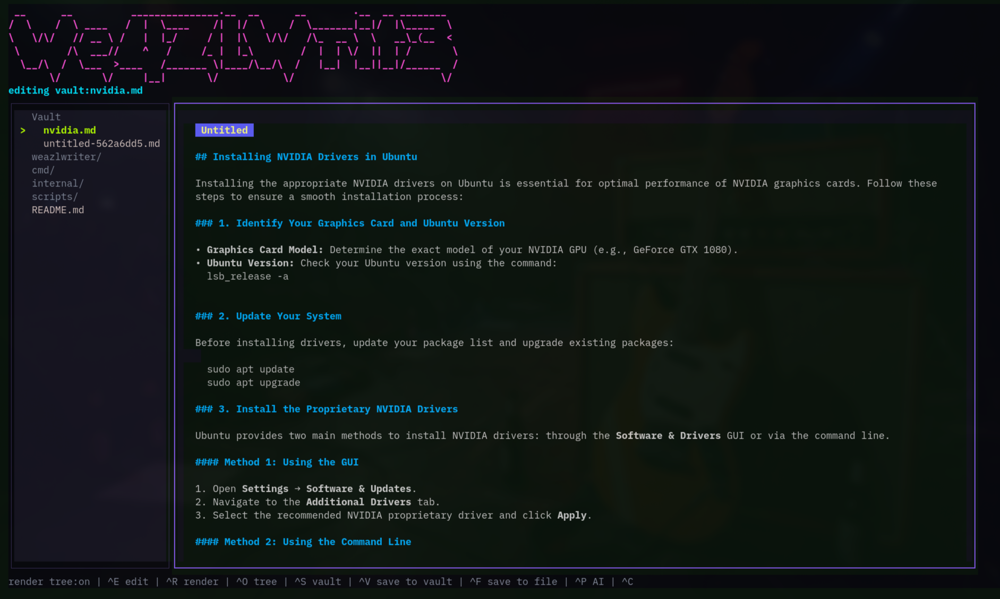

# WeazlWrite



WeazlWrite is a private, local-first Markdown writing TUI for vLLM and Ollama servers. Think of it as a quiet terminal desk for drafts, docs, notes, and little technical spells, with an encrypted vault tucked under the floorboards. No web wrapper, no account portal, no tabs breeding in the background. Just your files, your vault, your model, and the blinking cursor.

## Defaults

On first launch, WeazlWrite drops a fresh `config.json` into `~/.config/weazlwrite/` with sensible local defaults:

- `local-vllm`: `http://localhost:8000`
- model: `local-model`
- `local-ollama`: `http://localhost:11434`

Because hardcoding endpoints into a writing tool is how tiny annoyances become permanent roommates, WeazlWrite reads the endpoint and model from the config at runtime.

The encrypted vault lives under `~/.weazlwrite/vault`. Vault notes are stored in SQLite with a password-protected vault and AES-GCM encrypted payloads, but the TUI presents them as a filesystem-style tree. You can keep plain files on disk, encrypted notes in the vault, or bounce a draft between both worlds.

## Run

```sh
go run ./cmd/weazlwrite
go run ./cmd/weazlwrite ./notes/example.md
```

## Install

```sh
./scripts/install.sh
```

The installer takes care of the usual chores. It builds `weazlwrite`, tucks it into `~/.weazlwrite/bin`, and adds that directory to your shell `PATH` if it is not already present.

During setup, you will be prompted for your provider type and URL. The script queries the provider for available models, writes `~/.config/weazlwrite/config.json`, and boots straight into the TUI.

Provider URL rules: base URLs only, please.

- vLLM: `https://host:port` or `https://host`, without `/v1`
- Ollama: `http://host:11434`, without `/api`

If you accidentally paste the `/v1` or `/api` suffixes, the installer quietly fixes them for you.

Set `WEAZLWRITE_SKIP_LAUNCH=1` to install and configure without starting the TUI.

## Build From Source

WeazlWrite is a Go app, but it uses SQLite through `go-sqlite3`, so builds need Go 1.25 or newer, CGO, and a working C compiler. That is the one little bit of yak hair.

```sh
go build -o weazlwrite ./cmd/weazlwrite
go build -o weazlwrite-setup ./cmd/weazlwrite-setup
```

Useful environment overrides:

- `WEAZLWRITE_CONFIG=/path/to/config.json`
- `WEAZLWRITE_DATA=/path/to/data-dir`

## Keys

- `ctrl+e`: edit mode
- `ctrl+r`: rendered preview mode
- `ctrl+o`: show or hide the file tree
- `tab`: move between the file tree and the main writing surface
- `space`: fold or unfold the selected tree folder
- `ctrl+s`: save to the current target
- `ctrl+v`: save to the encrypted vault
- `ctrl+f`: save to a filesystem path
- `ctrl+p`: ask the local model to insert a Markdown block
- `ctrl+n`: new vault note
- mouse wheel: scroll the active surface
- `ctrl+c`: quit

## Vault And Files

The vault is encrypted SQLite, but it behaves like a note tree. Save something as `projects/specs/api.md`, and WeazlWrite shows it under `Vault / projects / specs / api.md`.

The left rail has two roots: `Vault` for encrypted notes and `Files` for regular filesystem work. Folders fold and unfold with `space`, and the active note gets a tiny marker so you can tell where you are without the tree turning into a blinking holiday display. A `*` means the current buffer has unsaved changes.

Press `ctrl+v` to save the current buffer into the encrypted vault. Press `ctrl+f` to save it out to the regular filesystem. Press `ctrl+s` when you simply want to save back to wherever the current note already lives.

That split is the point: draft in the open when the file belongs in a repo, tuck private notes into the vault when they should stay local and password-protected.

## Markdown And AI

Edit mode is for writing. Render mode is for reading what you just wrote without Markdown syntax shouting over the prose. WeazlWrite uses Charmbracelet Glamour so headings, lists, code blocks, quotes, links, and tables keep their terminal-native shape without turning the app into a browser.

Need a block of generated Markdown? Press `ctrl+p`, describe what you want, and WeazlWrite asks your configured local model to generate just the insertable block. While the model works, Bubble spinner animations and rotating Weazl-style status phrases keep the screen alive so it does not feel like the terminal fell asleep at the wheel.

## Security

WeazlWrite is local-first and privacy-minded, but it is still a small local app, not a hardware security module. The bcrypt password check and encrypted payloads are there to keep casual prying eyes out; they are not a promise that a weak password will survive a determined offline attack against your database.

- Vault notes live locally under `~/.weazlwrite/vault`.
- Vault payloads are encrypted with AES-GCM after unlock.
- API keys, if you add them later, belong in your local config.
- Filesystem saves are plain files. Vault saves are encrypted records. Choose accordingly.

## License And Branding

WeazlWrite is released under the MIT License. Use it, fork it, ship it, learn from it.

The `WeazlWrite` name, screenshot, and project branding are part of this project identity. If you publish a substantially modified fork, please use a different name and visual branding so users can tell the projects apart.
