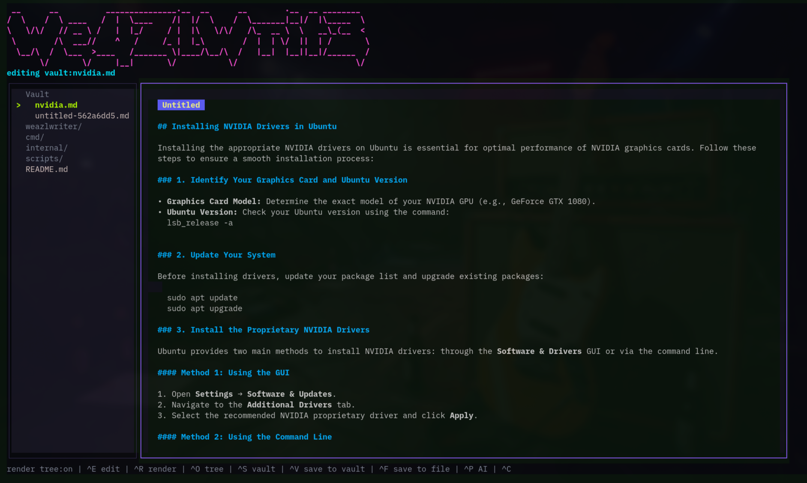

# WeazlWrite



A sovereign text editor for a paranoid age. WeazlWrite is a private, local-first Markdown writing TUI for vLLM and Ollama servers. Think of it as a quiet terminal desk for drafts, docs, notes, and little technical spells, backed by an encrypted vault tucked under the floorboards.

No web wrappers, no account portals, no telemetry drops, and no browser tabs breeding in the background. Just your files, your vaults, your models, and a cursor that actually belongs to the buffer.

## Defaults

On first launch, WeazlWrite drops a fresh `config.json` into the local app config den with sensible defaults:

- Linux/macOS: `~/.config/weazlwrite/config.json`
- Windows: `%APPDATA%\weazlwrite\config.json`

- `local-vllm`: `http://localhost:8000`
- model: `local-model`
- `local-ollama`: `http://localhost:11434`
- vault auto-lock: 15 minutes

Because hardcoding endpoints into a writing tool is how tiny annoyances become permanent roommates, WeazlWrite reads the endpoint and model from the config at runtime.

Encrypted vaults live under the local WeazlWrite data directory: `~/.weazlwrite/vault` on Linux/macOS and `%APPDATA%\weazlwrite\vault` on Windows. Vault notes are stored in SQLite with password-protected vaults and AES-GCM encrypted payloads, but the TUI presents each vault as a standard filesystem tree. Keep plain files on disk, lock private notes in the vault, or bounce a draft between both worlds.

## Run

```sh
go run ./cmd/weazlwrite
go run ./cmd/weazlwrite ./notes/example.md
```

## Install On Linux/macOS

```sh
./scripts/install.sh
```

No wizards. No corporate installers. The script handles the chores: it builds `weazlwrite`, tucks it into `~/.weazlwrite/bin`, and adds that directory to your shell `PATH`.

During setup, you will be prompted for your provider type and URL. The script queries the provider for available models, writes `~/.config/weazlwrite/config.json`, and boots straight into the TUI.

Provider URL rules: bare-metal base URLs only.

- vLLM: `https://host:port` or `https://host`, without `/v1`
- Ollama: `http://host:11434`, without `/api`

If you accidentally paste the `/v1` or `/api` suffixes, the installer quietly sanitizes them for you.

Set `WEAZLWRITE_SKIP_LAUNCH=1` to install and configure without triggering the TUI.

## Install On Windows

Run PowerShell from the repo root:

```powershell
Set-ExecutionPolicy -Scope Process Bypass
.\scripts\install.ps1
```

The Windows installer builds `weazlwrite.exe` and `weazlwrite-setup.exe`, puts them in `%APPDATA%\weazlwrite\bin`, creates `%APPDATA%\weazlwrite\vault`, writes `%APPDATA%\weazlwrite\config.json`, and adds the bin directory to your user `PATH`.

Because WeazlWrite uses SQLite through CGO, Windows needs Go and a C compiler. The installer checks for both. If they are missing and `winget` is available, it installs Go and MSYS2/UCRT GCC, then builds the app. If PowerShell still cannot see `go` or `gcc` immediately after install, open a fresh PowerShell window and rerun the script.

Set `WEAZLWRITE_SKIP_LAUNCH=1` or pass `-SkipLaunch` to install and configure without launching the TUI.

## Build From Source

WeazlWrite is a Go app, but it uses SQLite through `go-sqlite3`. Builds require Go 1.25.10 or newer, CGO, and a working C compiler. It is built to run on solid, reliable standards-based systems like Ubuntu LTS. That C compiler requirement is the one little bit of yak hair you have to shave.

```sh
go build -o weazlwrite ./cmd/weazlwrite
go build -o weazlwrite-setup ./cmd/weazlwrite-setup
```

Useful environment overrides:

- `WEAZLWRITE_CONFIG=/path/to/config.json`
- `WEAZLWRITE_DATA=/path/to/data-dir`

PowerShell uses the same overrides:

```powershell
$env:WEAZLWRITE_CONFIG = "C:\path\to\config.json"
$env:WEAZLWRITE_DATA = "C:\path\to\data"
```

## Keys

- startup vault picker: `up` / `down` choose, `enter` opens, `n` creates a new vault
- `ctrl+e`: edit mode from the tree or preview; end of line while writing
- `ctrl+r`: rendered preview mode
- `esc`: close the current popup, return from preview to editing, or leave the editor for the tree (revealing it if hidden)
- `ctrl+o`: show or hide the file tree
- `tab` / `shift+tab`: indent / outdent while writing; Tab switches panes outside the editor
- `enter`: open a selected file, or fold/unfold a selected folder
- `space`: pick up a file or note; move to a folder; press `space` again to drop it
- `n`: create a new document from the tree
- `ctrl+n`: create a new folder from the tree
- `alt+n`: create a new untitled vault note while writing
- `d`: delete the selected file, note, or empty folder
- `r`: rename or move the selected tree item by typing its new path
- `o`: toggle Eyes Only on a vault note
- `i`: import the selected filesystem file or folder into the encrypted vault
- `ctrl+s`: save now to the current target; vault drafts also save as you type
- `alt+v`: save to the encrypted vault
- `alt+s`: save to a filesystem path
- `ctrl+f`: find text; in the editor, keep writing visible and use Tab for replacement
- `f3` / `shift+f3`: next / previous editor match (`alt+f3` also goes backward)
- `alt+w`: cycle editor width: 80, 90, 100 columns, or the full pane
- `alt+t`: toggle typewriter scrolling
- `ctrl+g`: jump to a page in the current pane
- `alt+i`: ask the local model to insert a Markdown block
- `ctrl+a`: select all while writing; Home moves to the start of the line
- `shift+arrows`: select text; `ctrl+shift+left/right` selects by word
- `ctrl+c` / `ctrl+x`: copy / cut selected editor text
- `ctrl+z`: undo
- `ctrl+y` / `alt+z`: redo (`ctrl+shift+z` also works if your terminal sends it)
- `alt+m`: toggle app mouse capture; off lets the terminal drag-select text
- `alt+o`: toggle Eyes Only on the current vault note
- `f1`: open the full command popup
- `?` or `h`: open the full help screen when not typing in the editor
- `pgup` / `pgdown`: page the focused tree, editor, or render pane
- mouse wheel: scroll the tree or active writing surface
- click in the editor: place the cursor
- drag in the editor: select a range for replacement, copying, or cutting
- click in the tree: select that row
- `ctrl+q`: quit (`ctrl+c` also quits outside the editor); pending vault saves finish first, and unsaved disk drafts ask what to do

## Vault And Files

Each vault is an encrypted SQLite database disguised as a note tree. Save something as `projects/specs/api.md`, and WeazlWrite displays it cleanly under `Vault / projects / specs / api.md`.

On startup, WeazlWrite scans the vault directory and throws a vault picker. On Linux/macOS that is `~/.weazlwrite/vault`; on Windows it is `%APPDATA%\weazlwrite\vault`. Pick an existing vault, or press `n` to spin up a new context. New vaults require password confirmation before the database is forged. The selected vault path locks into your config, but the picker stays available on launch so context switching stays cheap.

Unlocked vaults auto-lock after 15 minutes of inactivity by default. Set `vault.auto_lock_minutes` in `config.json` to another positive number, or `0` to disable auto-lock.

The left rail splits your brain in two: `Vault` for the encrypted underground, and `Files` for regular surface-level filesystem work. The active note gets a tiny marker so you know exactly where you are without the tree turning into a blinking holiday display. A `*` means the current buffer has unsaved changes.

Big directories are fine. Move with `j` / `k`, the arrow keys, `pgup` / `pgdown`, the mouse wheel, or a click on the row you meant; the tree keeps the selected row in view instead of pretending the world ends at the bottom of the pane. Long names get truncated instead of wrapping the whole rail into a ransom note.

Tree chores happen right where your cursor is. Press `n` to create a new document in the selected folder, then type the path before it is created. Press `ctrl+n` for a new folder, `d` to delete a selected file or empty folder, and `r` to rename or move. Press `space` to pick up a file, navigate, and press `space` again to drop it. Folders fold and unfold with `enter`. While you are already writing, `alt+n` drops a new untitled vault note without making you wander back to the tree.

Press `alt+v` to save the current buffer into the encrypted vault. Press `alt+s` to save it out to the regular filesystem. Press `ctrl+s` when you want an immediate save back to wherever the current note already lives.

Vault drafts now save while you write: after roughly three-quarters of a second of quiet, or about every five seconds if the words refuse to stop coming. Background saves keep their mouths shut—no blinking save labels or dancing asterisks while you write. Ctrl+S still works. Press it, feel responsible, enjoy your tiny hit of administrative dopamine—it flushes the latest draft immediately and confirms when it’s saved.

The database work runs in the background, and Ctrl+S never claims victory for newer words just because an older write finished. Leaving a vault draft, opening another note, quitting, and auto-lock wait for pending saves. If a write fails, your draft stays put and Ctrl+S retries. Undo survives saving. Disk files still need an explicit save; rolling vault saves do not quietly turn your filesystem into an autosave experiment. This updates the current document, not a stack of historical revisions, and a crash can still lose the words typed since the last completed save.

To pull existing surface files into the encrypted vault, select a `.md`, `.markdown`, `.txt`, `.pdf`, or `.docx` file and press `i`. Select a folder and press `i` to bulk-import it as a vault root, perfect for absorbing Obsidian vaults that already live on disk. Word and PDF files are aggressively stripped down and converted to pure Markdown before encryption. Image-only PDFs and image-only Word files are rejected because there is no text to harvest.

The writing surface is a real buffer, not a form widget wearing a trench coat. Long lines wrap to the pane. The file keeps the newlines you typed; WeazlWrite will not reflow your Markdown on save, and it will not expand tabs just because you opened a note. Home and End jump the paragraph. `pgup` / `pgdown` move by what is on screen. `ctrl+z` undoes a burst of typing; `ctrl+y` or `alt+z` puts it back. `ctrl+v` pastes at the cursor. `ctrl+f` finds from where you are, including a second hit on the same line, and it will loop the document if it has to. In the editor, the search bar stays under the document: Enter/F3 advances, Shift+F3 (or Alt+F3) goes back, and Tab switches to a replacement field. Enter there replaces one match and moves on. F2 returns to writing with the match selected; Esc closes search and restores your starting position. No vanishing manuscript just because you wanted to hunt down your seventeenth “actually.”

Esc is your way out of the writing pane: it closes a search or command popup first; then clears any text selection; otherwise it puts you back in the tree, even if you hid the thing. Enter opens the selected note, and Ctrl+E puts you back in your current draft. No secret Vim handshake. Once the editor has focus, typing writes words.

Vault departures flush pending changes before moving on. For an unsaved disk draft, opening another document or quitting offers **S** to save and continue, **D** to discard, or **Esc** to stay put. A failed save keeps the draft alive. Just visiting the tree with Esc does not save or discard a disk file. If a vault write is still running when you ask to leave, Esc cancels the departure while the save keeps working.

Tab now does the job its little plastic keycap promised: insert four spaces, or nest the current list item. Shift+Tab removes up to four leading spaces or one existing tab from the current line. Existing tabs stay tabs on disk. Alt+D deletes the next word; filesystem Save As lives on Alt+S. Move the cursor before making a different edit and undo remembers the boundary. Paste gets its own undo step, because dropping a paragraph should not drag your last sentence into the shredder with it. Enter continues bullets, numbered lists, checkboxes, and blockquotes. Empty items step back out; Backspace at the start of the text removes a nesting level or the marker. Finished a checkbox? The next one starts unchecked, because optimism is not a task tracker. Fenced code keeps its indentation and stays free of list meddling; pasted Markdown arrives as you sent it. The hidden Markdown preview also waits until you ask to see it, instead of making every keystroke pay the rendering tax.

The writing column defaults to 90 characters, centered inside the existing pane. Alt+W cycles 80, 90, 100, and full width; Alt+T toggles typewriter scrolling. Ordinary scrolling leaves a few rows of breathing room below the cursor. Those preferences survive a restart. In `config.json`, `ui.editor_width` sets the column (`0` uses the full pane), `ui.editor_scroll_margin` sets the breathing room (default `3`), and `ui.editor_typewriter` keeps the cursor near the middle. These are visual choices, not permission to rearrange your newlines. The editor also paints the visible rows instead of repainting the entire novel every time you sneeze on the keyboard.

Drag in the writing pane to select a character range; release keeps it selected. Type or paste to replace it, Backspace/Delete to remove it, Ctrl+C to copy, or Ctrl+X to cut. Shift+arrows select without the mouse; Ctrl+Shift+left/right grabs words, and Ctrl+A grabs the lot. Esc clears the selection first. Clipboard failure leaves a cut intact, because losing words is a rotten way to discover your clipboard is on strike. Click without dragging only moves the cursor. Mouse scrolling and terminal drag-selection still fight over the same events, so press `alt+m` when you want the terminal to own the mouse, then press `alt+m` again when you want WeazlWrite's click, drag, and wheel back.

## Eyes Only Mode

Some notes belong in the vault, not lingering in your system clipboard. Eyes Only mode lets you lock down an encrypted note so it stays readable and editable, without becoming easy prey for an accidental text harvest.

Hit `o` from the tree, or `alt+o` while the vault note is open. Eyes Only files glow high-alert orange in the tree, so you know exactly what you're dealing with before you hit enter.

When an Eyes Only note is live, WeazlWrite keeps app mouse capture on, ignores `alt+m`, and blocks copying and cutting. Selection and replacement inside the editor still work. You can read the file, grind out edits, and save it back to the encrypted vault. You cannot casually harvest the buffer into a clipboard.

Dropping the shield requires actual intent. Press `o` or `alt+o` and explicitly confirm the warning prompt before the note returns to standard behavior.

This isn't magic DRM, and it won't stop someone with a smartphone from taking a picture of your monitor. It's an anti-foot-gun mechanism for paranoid drafting: encrypted on the metal, visible when unlocked, and deliberately frustrating to casually copy.

That split rail is the entire point: draft in the open when the code belongs in a repo, tuck private notes into the vault when they should not leave the bare metal.

## Markdown And AI

Edit mode is for grinding out text. Render mode is for reading it back without syntax shouting over the prose. WeazlWrite is built on the beautiful Bubble Tea UI framework and uses Glamour so headings, code blocks, and tables keep their terminal-native shape without turning your TUI into a bloated browser. Line numbers in the editor wear the same violet as the folders in the tree, because matching chrome is not the same thing as growing a UI.

Need a generated Markdown block? Press `alt+i`, describe the spell, and WeazlWrite hits your configured local model for the exact insertable text. The model judges. The Go app inserts. While it grinds, terminal spinners and rotating Weazl-style status phrases keep the screen alive so you know the hardware is working. `ctrl+z` will take the insert back if the spell was a dud.

## Security

WeazlWrite is strictly local-first and built for paranoia, but it is a TUI app, not a hardware security module. The bcrypt checks and AES-GCM payloads exist to lock out casual snooping and keep your data sovereign. They are not a guarantee that a weak password will survive a dedicated offline attack if someone physically steals your rig.

- Vault databases live locally under `~/.weazlwrite/vault` on Linux/macOS or `%APPDATA%\weazlwrite\vault` on Windows.
- Vault payloads are encrypted with AES-GCM after unlock.
- Failed vault password attempts are rate-limited with increasing in-memory backoff delays.
- Unlocked vault sessions auto-lock after the configured inactivity timeout and clear visible document content.
- API keys belong in your local config, nowhere else.
- Filesystem saves are plain files. Vault saves are encrypted records. Choose accordingly.

## License And Branding

WeazlWrite is released under the MIT License. Fork it, learn from it, ship it.

The `WeazlWrite` name, screenshot, and cyborg-ferret branding are part of this project's identity. If you publish a heavily modified fork, strip the branding and rename it so users know who is actually maintaining the code.
